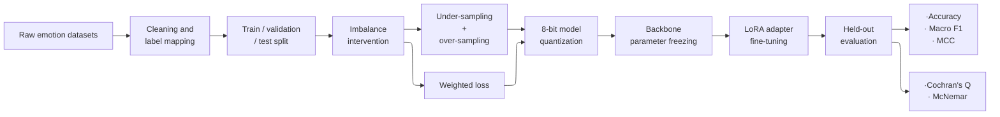
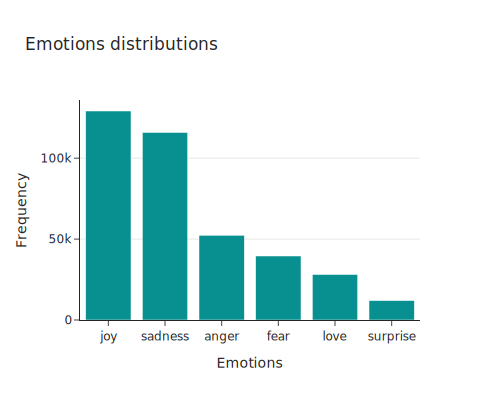
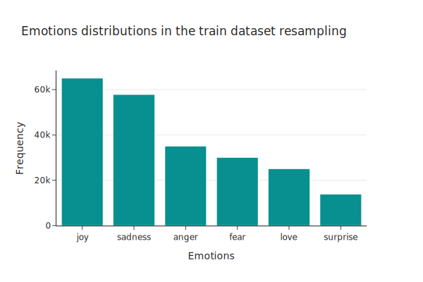
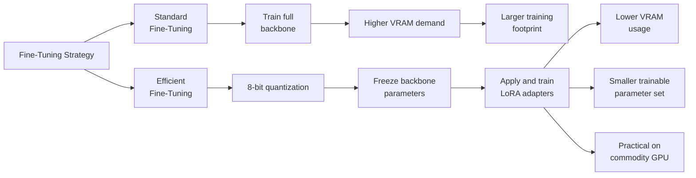
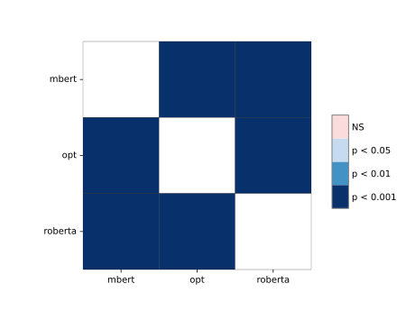

# Emotional Sentiment Benchmark: Quantised Transformers Pipeline

[](https://www.python.org/downloads/)
[](https://pytorch.org/)
[](https://huggingface.co/)
[](https://github.com/pytorch/ao)
[](https://scikit-learn.org/)
[](https://www.jetbrains.com/pycharm/)

An end-to-end comparative benchmark of **ModernBERT**, **RoBERTa**, and **Facebook-OPT-350m** for multi-class emotion classification. The project evaluates how **8-bit weight-only quantization**, followed by **backbone parameter freezing** and **LoRA-based parameter-efficient fine-tuning (PEFT)**, affects classification quality, training efficiency, and VRAM usage on commodity GPU hardware.

While large language models are often associated with chatbot-style generation, this repository benchmarks **transformer-based large language model backbones** adapted for supervised **sequence classification**, keeping the training objective aligned with emotion labelling rather than causal text generation.

The codebase is designed to be modular and reusable, so the workflow can be adapted to other supervised text-classification datasets with minimal changes. The released adapters are also reusable and can serve as efficient starting points for further fine-tuning on related classification tasks built on the same base architectures.

## 🔑 At a Glance
- 3-model benchmark across **ModernBERT**, **RoBERTa**, and **Facebook-OPT-350m**
- 6-class emotion classification on a corpus of **450,000+** Twitter-derived samples
- **8-bit quantization → backbone freezing → LoRA-based PEFT**
- Best overall performer: **ModernBERT-base** with **98.87% accuracy** and **0.9757 Macro F1**
- Most efficient configuration: **RoBERTa-base**, with the lowest VRAM footprint and fastest training time

## 📂 Project Structure

```text
.
├── data/                     # Dataset 
├── results/                   
│   ├── metrics/              # Performance logs (F1, Accuracy, MCC)
│   ├── plots/                # Distribution, CM, and Significance SVGs
│   └── weights/              # Local adapter storage (ignored by git)
├── tests/                    # Initial unit tests for statistical utilities
├── utilities/                # Modular DS Library
│   ├── balance_dataset.py    # Resampling interventions
│   ├── emotions_dataset.py   # Dataset loading and mapping
│   ├── eval_metrics.py       # Metrics calculation logic
│   ├── hf_pipeline.py        # Selective Quantization & Loading
│   ├── stats_tools.py        # Cochran’s Q & McNemar tests
│   └── weighted_loss.py      # Custom Weighted Cross-Entropy
├── llm_lora_emotion_analysis.ipynb  # Main Experiment Entry Point
├── train.py               # Model training / PEFT fine-tuning
├── eval.py               # Evaluation and benchmark reporting
└── README.md

```

## 📊 Dataset Architecture

The study consolidates a corpus of over **450,000** Twitter-derived text samples to capture a broad range of emotional language patterns.

* **Primary Sources**: Kaggle (N. Elgiriyewithana) and DataWorld (CrowdFlower)
* **Labels**: `id2label = {0: 'sadness', 1: 'joy', 2: 'love', 3: 'anger', 4: 'fear', 5: 'surprise'}`
* **Quality Audit**: A severe class imbalance ratio of roughly **10:1** (Joy vs. Surprise) was addressed through targeted resampling and cost-sensitive learning to reduce majority-class bias.

## 🏗️ Benchmark Pipeline



## 🏗️ Technical Stack & Optimizations

### 1. Resource Optimisation (Efficiency)

* **Torchao Int8 Quantization**: Backbone weights were transformed into **Int8 Tensor Subclasses**, reducing VRAM footprint while preserving strong classification performance.
* **Quantization → parameter freezing → LoRA-based PEFT**: The base model was first quantized to **8-bit**, then its backbone parameters were frozen, and finally **LoRA adapters** were applied as the only trainable components. For **ModernBERT**, only **1.1197%** of parameters were trainable.
* **Fused SDPA**: Utilized hardware-native kernels via `scaled_dot_product_attention` for optimized throughput on NVIDIA L4 GPUs.

### 2. Model Interventions (Fairness & Balance)

To address the severe class imbalance, a multi-stage intervention was implemented:

* **Hybrid Resampling**: Utilised `RandomUnderSampler` and `OverSampler` strictly on the training split to ensure a balanced signal.
* **Cost-Sensitive Learning**: Implemented a **Custom Weighted Cross-Entropy Loss** to penalize misclassifications of minority emotions.

<table style="border-collapse: collapse; border: none; width: 100%;">
<tr>
<td style="width: 50%; text-align: center; border: none;">

<sub><b>Figure 1a:</b> Baseline Class Imbalance.</sub>
</td>
<td style="width: 50%; text-align: center; border: none;">

<sub><b>Figure 1b:</b> Post-Intervention (Balanced).</sub>
</td>
</tr>
</table>

> **Strategic Insight:** The transition from **1a** to **1b** shows how the hybrid resampling pipeline improved minority-class representation in the training data, ensuring each minority emotion reached at least a 20% relative frequency threshold.


## 🧭 Why Quantization + PEFT Matters



## 📈 Performance & Efficiency Benchmark

The models were evaluated strictly on out-of-sample test sets. **ModernBERT-base** delivered the strongest overall classification performance, while **RoBERTa-base** remained the fastest and lightest configuration in the benchmark.

| Model Architecture | Accuracy | Macro F1 | MCC (95% CI) | Precision (Love/Surprise) | Train Time | VRAM (Weights) |
| --- | --- | --- | --- | --- | --- | --- |
| **ModernBERT-base** | **98.87%** | **0.9757** | **0.9849** *(0.9839-0.9859)* | **0.97 / 0.90** | 2:50:08 | 429.48 MiB |
| **Facebook-OPT-350m** | 98.11% | 0.9663 | 0.9749 *(0.9737-0.9763)* | 0.96 / 0.90 | 2:35:48 | 581.01 MiB |
| **RoBERTa-base** | 97.62% | 0.9622 | 0.9683 *(0.9669-0.9697)* | 0.95 / 0.88 | **1:21:33** | **329.66 MiB** |

<div align="center">

<p align="center">
<sub><b>Figure 2:</b> Confusion Matrix for ModernBERT-base. High diagonal density confirms robust per-class recall.</sub>
</p>
</div>

## 🔬 Statistical Rigour

To assess whether observed performance differences were unlikely to be due to chance, a frequentist validation framework was applied:

* **Cochran’s Q Test**: omnibus test for differences across the three paired model prediction sets
* **McNemar’s Pairwise Test**: post-hoc test for significant pairwise differences in predictions when the omnibus result was significant

Pairwise testing indicated that **ModernBERT** significantly outperformed at least one competing architecture (Figure 3).

<div align="center">

<p align="center">
<sub><b>Figure 3:</b> Pairwise McNemar post-hoc comparisons across benchmarked models. The plot summarises which paired prediction differences are statistically significant.</sub>
</p>
</div>

### Directional Analysis

Positive values indicate an advantage for the first model listed.

| Model Comparison | Accuracy Difference |
| --- | --- |
| **ModernBERT vs. RoBERTa** | 0.01250 |
| **ModernBERT vs. OPT-350m** | 0.00753 |
| **OPT-350m vs. RoBERTa** | 0.00497 |

## ✅ Current Validation

- Unit tests currently cover selected statistical utility functions used in the evaluation pipeline.
- Broader test coverage for data utilities and benchmarking components will be extended in future iterations.

## 🛠️ Usage & Inference

### 1. Environment Installation

This project was developed in **PyCharm** for modular engineering and trained on **Google Colab (L4 GPU)** for compute.

```bash
pip install -U -q "transformers==5.2.0" "peft==0.18.1" "torchao==0.16.0" 
pip install -q imbalanced-learn evaluate scikit-posthocs plotly

```

### 2. Load and Merge Adapters

The example below shows how to load and merge the **ModernBERT** adapter. Additional adapter checkpoints are listed in the **Model Weights** section below.

```python
import torch
from transformers import AutoModelForSequenceClassification
from peft import PeftModel
from torchao.quantization import quantize_, Int8WeightOnlyConfig

# Load and Quantize Base Model
model = AutoModelForSequenceClassification.from_pretrained("answerdotai/ModernBERT-base", num_labels=6)
quantize_(model, Int8WeightOnlyConfig(version=2))

# Load & Merge LoRA Adapters for zero-latency inference
model = PeftModel.from_pretrained(model, "Wb-az/peft-modernbert-base")
model = model.merge_and_unload()

```

## 📌 Key Takeaways

- **ModernBERT-base** delivered the strongest overall performance across Accuracy, Macro F1, and MCC.
- **RoBERTa-base** offered the best efficiency profile, with the lowest VRAM footprint and fastest training time.
- The benchmark shows that **quantized backbones with LoRA-based PEFT** can preserve strong classification quality while making fine-tuning more practical on commodity GPU hardware.
- Beyond architecture and fine-tuning strategy, the benchmark reinforces that data quality and in-process algorithmic interventions are the strongest contributors to reliable classification performance.

## 🔗 Model Weights
* [Wb-az/peft-modernbert-base](https://huggingface.co/Wb-az/peft-modernbert-base)
* [Wb-az/peft-opt-350m](https://huggingface.co/Wb-az/peft-opt-350m)
* [Wb-az/peft-roberta-base](https://huggingface.co/Wb-az/peft-roberta-base)

## 🚀 Next Steps
- **Expand and diversify the dataset** to improve class coverage, linguistic variation, and robustness across emotion categories
- **Strengthen the data process** through better data curation, label quality checks, and governance-aware documentation of collection and preprocessing decisions
- **Conduct targeted error analysis** to identify whether remaining failures are driven by data limitations, label ambiguity, or model bias
- **Assess probability calibration only in higher-risk or data-constrained settings**, where confidence reliability may be needed as an interim safeguard while better data solutions are not yet feasible

